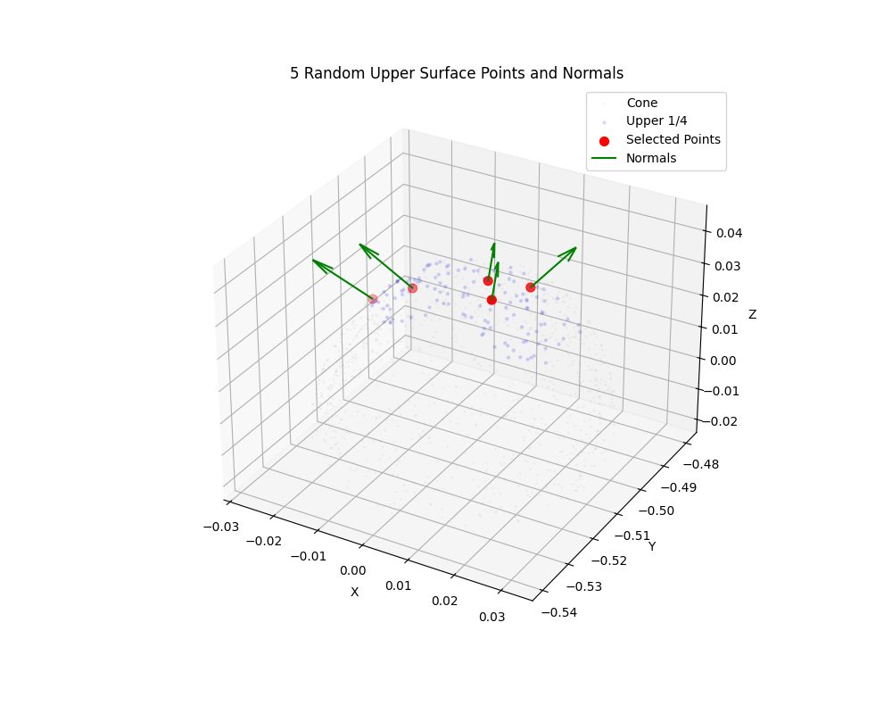

# Tactile UR5

Automated tactile exploration of a silicone cone using a UR5 robot arm. The pipeline extracts surface geometry from a CAD model, calibrates it to the robot's coordinate frame via ICP, generates approach/press poses for each surface point, and executes them on the physical (or simulated) robot over a raw URScript TCP socket.

```
cone.STL → surface points → ICP calibration → touch poses → robot execution
```

---

## Hardware

| Component | Details |
|---|---|
| Robot | Universal Robots UR5 |
| Tool | Silicone cone tactile sensor |
| Tool tip offset | 86 mm along TCP +Z axis |
| Real robot IP | `192.168.0.153` |
| Simulation IP | `172.17.0.2` (URSim Docker) |
| Communication port | `30003` (URScript primary interface) |

---

## Setup

```bash
# Activate the virtual environment
source cad_env/bin/activate

# Or install dependencies manually
pip install trimesh numpy pandas scipy matplotlib
```

---

## Pipeline

### Step 1 — Extract surface points from STL

Samples 3000 points (with surface normals) from the cone CAD model.

```bash
python extract_points.py
```

**Input:** `cone.STL`  
**Output:** `surface_points.csv` — columns: `x, y, z, nx, ny, nz` (in mm, STL frame)

---

### Step 2 — (Optional) Visualise the point cloud

```bash
# Plot sampled surface points
python cone_plot.py

# Plot surface points with corrected outward normals
python cone_plot_normals.py
```

**Outputs:** `figures/surface__points_cone_plot.png`, `figures/surface__points_cone_normals_plot.png`

| Point cloud | Surface normals |
|---|---|
|  |  |

---

### Step 3 — Record physical calibration points

Interactive CLI. Move the robot so the sensor tip physically touches the cone and read the TCP pose from the teach pendant for each point.

```bash
python record_icp_points.py
```

- **Point 1 must be the cone apex** (top).
- Record 10–15 more points spread around the upper sides.
- Enter each pose as `x y z rx ry rz` (mm or m — auto-detected; radians for rotation).
- Type `done` when finished.

**Output:** `physical_points.csv` — columns: `x_tcp, y_tcp, z_tcp, rx, ry, rz, x, y, z`

---

### Step 4 — Run ICP calibration

Aligns the STL point cloud to the robot base frame using the physical touch points as ground truth.

```bash
python calibrate_icp.py
```

**Inputs:** `surface_points.csv`, `physical_points.csv`, `cone.STL`  
**Outputs:**
- `icp_transformation_matrix.txt` — 4×4 STL-to-robot transform
- `surface_points_base.csv` — surface points (with normals) in robot base frame (meters)

Calibration quality (mean/RMS/max error in mm) is printed on completion. Target: mean error < 5 mm.

---

### Step 5 — Validate calibration

Re-checks alignment by projecting recorded physical contact points onto the calibrated mesh.

```bash
python validate_calibration.py
```

**Inputs:** `physical_points.csv`, `icp_transformation_matrix.txt`, `surface_points_base.csv`  
Re-run `calibrate_icp.py` if mean error exceeds 5 mm.

---

### Step 6 — Generate touch poses

Three options depending on the experiment scope:

#### 6a — Full surface coverage

Generates approach and press TCP poses for every point in `surface_points_base.csv`.

```bash
python generate_touch_poses.py
```

**Output:** `touch_poses.csv`

#### 6b — Random upper-surface poses

Selects `NUM_POINTS` points (default: 5) from the upper quarter of the cone, spread evenly by angle and filtered to within `MAX_Y_OFFSET_M` of the apex Y row.

```bash
python generate_random_upper_poses.py
```

**Output:** `random_upper_touch_poses.csv`, `figures/random_upper_points_plot.png`



#### 6c — Side strips around the cone (top to bottom)

Generates `NUM_STRIPS` vertical strips evenly distributed around the cone, each with `NUM_POINTS` touch points from the apex down to `MIN_HEIGHT_FRACTION` of the cone height. Each height band picks the surface point closest to the strip's target angle.

To keep the printed sensor holder clear of the cone surface at lower touch points, the tool orientation is tilted toward vertical with height-scaled magnitude: 0° at the apex band up to `MAX_ORIENTATION_TILT_DEG` (15°) at the lowest band. Only the orientation tilts — the contact point and press direction stay on the true surface normal. The applied tilt is recorded per pose in the `tilt_deg` CSV column.

```bash
python generate_side_strip_poses.py
```

**Output:** `cone_touch_poses.csv` (with `strip` and `strip_angle_deg` columns), `figures/cone_touch_poses.png`


Key parameters at the top of the script:

| Parameter | Default | Description |
|---|---|---|
| `NUM_STRIPS` | `4` | Strips evenly distributed around the cone |
| `NUM_POINTS` | `8` | Touch points per strip (top → bottom) |
| `MIN_HEIGHT_FRACTION` | `0.6` | Lower bound of the strips (fraction of cone height) |

Each row in all pose CSVs contains a paired approach pose (15 mm stand-off along the surface normal) and a press pose (10 mm into the surface).

---

### Step 7 — Move robot to start pose

Moves the robot from the home configuration through a safe pre-pose to the hover position directly above the cone apex (10 mm clearance).

```bash
python movement_scripts/home_start.py
```

Prompts for `sim` or `real` mode. Motion sequence:

```
Home joints [0, -π/2, 0, -π/2, 0, 0]
  └─ movej → Pre-pose [-π/2, -π/2, -π/2, -π/2, π/2, -π/2]
       └─ movel → Start pose (apex TCP + 10 mm Z)
```

To move directly to the start pose only (skipping the pre-pose joint move):

```bash
python movement_scripts/start_pose.py
```

---

### Step 8 — Execute touch sequence

Streams the full URScript program to the robot. For each pose: transit to approach → press → retract. Prompts for `sim` or `real` (speeds come from `A_sim`/`V_sim`/`A_real`/`V_real` in `pose_utils.py`). The robot returns to the start pose after all touches complete.

```bash
# Run random upper-surface poses (from step 6b)
python run_random_upper_poses.py

# Run side strip poses (from step 6c)
python run_side_strip_poses.py
```

Motion strategy (`run_side_strip_poses.py`):

- **Transits use `movej(get_inverse_kin(pose, qnear))`** — joint-space interpolation avoids the wrist/shoulder singularities that `movel` transits can pass through. Every IK call is biased toward a fixed safe reference configuration (`qnear`, the pre-pose) so solutions stay in the same branch and never wind up toward joint limits as the strips wrap around the cone.
- **Press and retract use `movel`** — short, controlled linear motion along the surface normal.
- **Strip changes go through a via point** 50 mm above the apex (`VIA_CLEARANCE_M`), so the transit from the bottom of one strip to the top of the next passes over the cone instead of through it.
- Each transit logs the pose index, strip, and IK joint solution via `textmsg` — visible in the PolyScope Log tab to identify the failing pose after a protective stop.

---

### Step 9 — Return to home

```bash
python movement_scripts/go_home.py
```

Sends a single `movej` command to the home configuration `[0, -π/2, 0, -π/2, 0, 0]`.

---

### Emergency stop

Immediately decelerates and stops the robot (does not require mode selection).

```bash
python movement_scripts/stop_robot.py
```

Sends `stopl(1.2)` directly to the real robot at `192.168.0.153`.

---

## File Reference

| File | Description |
|---|---|
| `cone.STL` | CAD model of the silicone cone tool |
| `pose_utils.py` | Geometry helpers (TCP↔contact conversion, normal→rotation vector, orientation tilt) and shared motion parameters (speeds, distances) |
| `extract_points.py` | Sample surface points and normals from STL |
| `cone_plot.py` | Visualise sampled surface point cloud |
| `cone_plot_normals.py` | Visualise surface points with corrected outward normals |
| `record_icp_points.py` | Interactively record physical touch points from the teach pendant |
| `calibrate_icp.py` | ICP alignment of STL to robot base frame |
| `validate_calibration.py` | Verify calibration quality against recorded points |
| `generate_touch_poses.py` | Generate approach/press poses for the full surface |
| `generate_random_upper_poses.py` | Generate poses for random upper-surface points |
| `generate_side_strip_poses.py` | Generate poses for multiple strips around the cone, top to bottom |
| `run_random_upper_poses.py` | Execute upper-surface touch sequence on the robot |
| `run_side_strip_poses.py` | Execute side strip touch sequence on the robot |
| `movement_scripts/home_start.py` | Move robot home → pre-pose → start pose |
| `movement_scripts/start_pose.py` | Move robot directly to start pose |
| `movement_scripts/go_home.py` | Return robot to home configuration |
| `movement_scripts/stop_robot.py` | Emergency stop |
| `surface_points.csv` | Raw STL surface points (mm, STL frame) |
| `surface_points_base.csv` | Surface points in robot base frame (m) |
| `physical_points.csv` | Recorded physical touch points from teach pendant |
| `icp_transformation_matrix.txt` | 4×4 STL-to-robot transform from ICP |
| `touch_poses.csv` | Full-surface touch poses |
| `random_upper_touch_poses.csv` | Random upper-surface touch poses |
| `cone_touch_poses.csv` | Side strip touch poses (with strip index and tilt per pose) |
| `figures/` | Saved plot outputs |
| `robot_data/` | Directory for robot execution logs and recorded data |
| `cad_env/` | Python virtual environment |

---

## Key Parameters

Defined in `pose_utils.py` and the generator scripts:

| Parameter | Value | Location |
|---|---|---|
| Tool tip offset | `[0, 0, 0.086]` m | `pose_utils.py` |
| Start clearance | `0.01` m (10 mm above apex) | `pose_utils.py` |
| Default start orientation | `[-2.2, 2.2, 0.0]` rad | `pose_utils.py` |
| Approach stand-off | `0.015` m | `pose_utils.py` |
| Press depth | `0.01` m | `pose_utils.py` |
| Max orientation tilt | `15°` (scaled with height) | `pose_utils.py` |
| Sim speed / acceleration | `V_sim = 1` m/s, `A_sim = 2.5` m/s² | `pose_utils.py` |
| Real speed / acceleration | `V_real = 0.05` m/s, `A_real = 0.1` m/s² | `pose_utils.py` |
| Inter-strip via clearance | `0.05` m above apex | `run_side_strip_poses.py` |
| Upper zone threshold | top 25 % of cone height | `generate_random_upper_poses.py` |
| Number of strips | `4` (evenly around the cone) | `generate_side_strip_poses.py` |
| Side strip lower bound | `0.6` (60 % from base) | `generate_side_strip_poses.py` |

