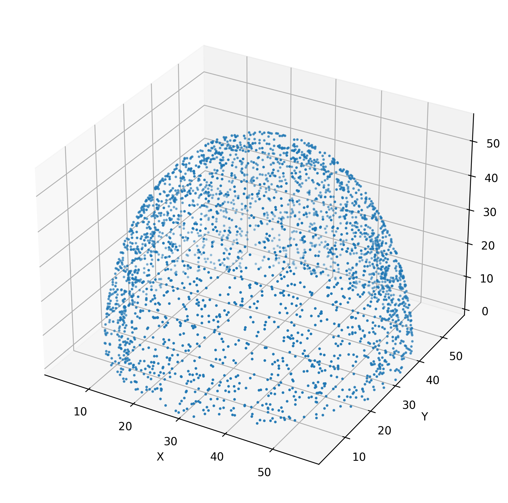
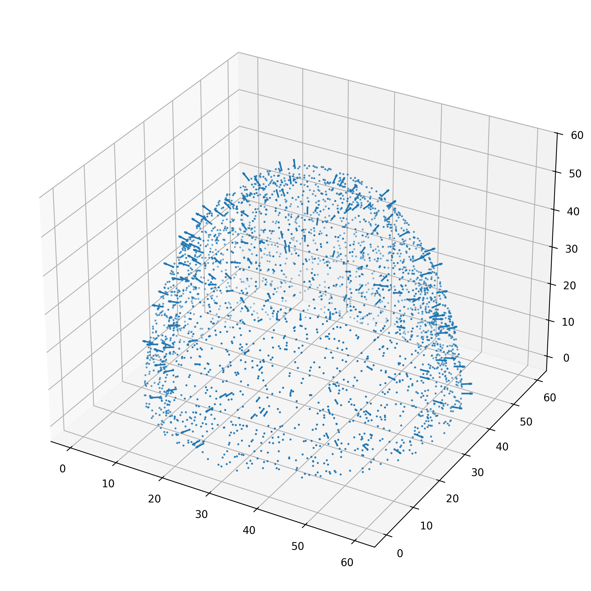
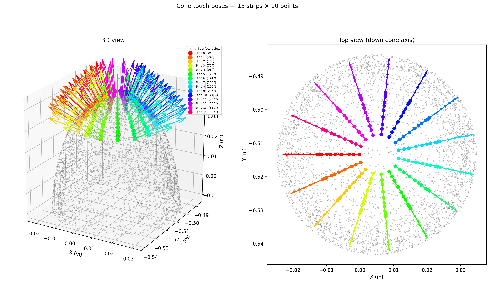

# Tactile UR5

Automated tactile exploration of a silicone cone using a UR5 robot arm. The pipeline extracts surface geometry from a CAD model, calibrates it to the robot's coordinate frame via ICP, generates approach/press poses for each surface point, executes them on the physical (or simulated) robot over a raw URScript TCP socket, and records the contact force (ATI Nano17) synchronized with the TCP pose for each press.

```
cone.STL → surface points → ICP calibration → touch poses → robot execution → force+pose recording
```

---

## Hardware

| Component | Details |
|---|---|
| Robot | Universal Robots UR5 |
| Tool | Silicone cone tactile sensor |
| Tool tip offset | 86 mm along TCP +Z axis |
| Force sensor | ATI Nano17 (SI-50-0.5), serial `FT12876` |
| Force DAQ | NI-DAQ, read via pyForceDAQ (`nidaqmx` backend) |
| Real robot IP | `192.168.0.110` (set as `REAL_HOST` in `pose_utils.py`) |
| Simulation IP | `172.17.0.2` (URSim Docker) |
| Touch-program port | `30002` (secondary client) — used by `run_side_strip_poses.py` so the streamed program does **not** suspend the state broadcast |
| Command / state port | `30003` (single moves like home/start/stop, and the 125 Hz TCP-pose stream the recorder reads) |

---

## Setup

The workstation dependencies are pinned in `requirements.txt`. The `cad_env/`
virtualenv is **not** tracked in git — recreate it from the requirements file:

```bash
# Create and activate the virtualenv, then install dependencies
python3 -m venv cad_env
source cad_env/bin/activate
pip install -r requirements.txt
```

On later sessions just activate it:

```bash
source cad_env/bin/activate
```

**DAQ PC only** — the force + pose recorder in `pyForceDAQ/` additionally needs
`nidaqmx` and `psutil` (uncomment them in `requirements.txt`), the NI-DAQmx
system driver, and `atidaq.so` built from `pyForceDAQ/atidaq_cdll/`. See the
[Force + pose data collection](#force--pose-data-collection-pyforcedaq) section.

---

## Project structure

Scripts are grouped by pipeline stage. Every script resolves data files through
`paths.py`, so they can be run from any working directory (e.g.
`python pose_generation/generate_touch_poses.py` from the repo root).

```
tactile_UR5/
├── paths.py              # central path config (single source of truth)
├── pose_utils.py         # shared geometry + motion parameters
├── geometry/             # extract_points.py  (STL → surface points)
├── ur_calibration/       # ICP calibration scripts + their artifacts
├── pose_generation/      # generate_*.py  (surface points → touch poses)
├── execution/            # run_*.py + robot move/stop scripts
├── cone_plots/           # point-cloud / normals visualisation
├── pyForceDAQ/           # force + pose recording (ATI Nano17)
├── data/                 # cone.STL + generated pose CSVs
└── figures/              # plot outputs
```

---

## Pipeline

### Step 1 — Extract surface points from STL

Samples 3000 points (with surface normals) from the cone CAD model.

```bash
python geometry/extract_points.py
```

**Input:** `data/cone.STL`  
**Output:** `data/surface_points.csv` — columns: `x, y, z, nx, ny, nz` (in mm, STL frame)

---

### Step 2 — (Optional) Visualise the point cloud

```bash
# Plot sampled surface points
python cone_plots/cone_plot.py

# Plot surface points with corrected outward normals
python cone_plots/cone_plot_normals.py
```

**Outputs:** `figures/surface__points_cone_plot.png`, `figures/surface__points_cone_normals_plot.png`

| Point cloud | Surface normals |
|---|---|
|  |  |

---

### Step 3 — Record physical calibration points

Interactive CLI. Move the robot so the sensor tip physically touches the cone and read the TCP pose from the teach pendant for each point.

```bash
python ur_calibration/record_icp_points.py
```

- **Point 1 must be the cone apex** (top).
- Record 10–15 more points spread around the upper sides.
- Enter each pose as `x y z rx ry rz` (mm or m — auto-detected; radians for rotation).
- Type `done` when finished.

**Output:** `ur_calibration/physical_points.csv` — columns: `x_tcp, y_tcp, z_tcp, rx, ry, rz, x, y, z`

---

### Step 4 — Run ICP calibration

Aligns the STL point cloud to the robot base frame using the physical touch points as ground truth.

```bash
python ur_calibration/calibrate_icp.py
```

**Constrained to a vertical axis.** The calibration **pins the cone axis to the robot base +Z** and fits only the position (translation-only ICP). The reason: the calibration touch points all sit near the apex (top ~half of the cone), which barely constrains the axis *orientation* — a free ICP latches onto noise and produces a spurious ~20° tilt, making an upright cone look leaning in the base frame. Since the cone physically stands upright on a level surface, fixing the axis vertical removes that artifact and actually fits the points slightly better (RMS ≈ 2.2 mm vs 2.5 mm for the free fit). Rotation about the vertical is irrelevant for a surface of revolution, so it is left at identity.

> This assumes the robot base is mounted vertical and the cone sits on a level surface. If your base is genuinely tilted, restore a free ICP instead.

**Inputs:** `data/surface_points.csv`, `ur_calibration/physical_points.csv`, `data/cone.STL`  
**Outputs:**
- `ur_calibration/icp_transformation_matrix.txt` — 4×4 STL-to-robot transform (rotation = identity, i.e. cone upright)
- `ur_calibration/surface_points_base.csv` — surface points (with normals) in robot base frame (meters)

Calibration quality (mean/RMS/max error in mm) is printed on completion. Target: mean error < 5 mm.

---

### Step 5 — Validate calibration

Re-checks alignment by projecting recorded physical contact points onto the calibrated mesh.

```bash
python ur_calibration/validate_calibration.py
```

**Inputs:** `ur_calibration/physical_points.csv`, `ur_calibration/icp_transformation_matrix.txt`, `ur_calibration/surface_points_base.csv`  
Re-run `ur_calibration/calibrate_icp.py` if mean error exceeds 5 mm.

---

### Step 6 — Generate touch poses

Two options depending on the experiment scope:

#### 6a — Full surface coverage

Generates approach and press TCP poses for every point in `ur_calibration/surface_points_base.csv`.

```bash
python pose_generation/generate_touch_poses.py
```

**Output:** `data/touch_poses.csv`

#### 6b — Side strips around the cone (top to bottom)

Generates `NUM_STRIPS` vertical strips evenly distributed around the cone, each with `NUM_POINTS` touch points from near the apex down to `MIN_HEIGHT_FRACTION` of the cone height. All work is done in the cone's own axis frame (axis from the calibration, now vertical).

Each contact point is **synthesized directly on the strip's meridian** rather than picking the nearest measured point. Because the cone is a surface of revolution, this gives:

- **Straight strips** — every point of a strip sits at exactly the strip's azimuth, so the strip traces a clean line down the cone (no zig-zag from discrete sampling).
- **Even spacing** — points are placed at evenly-spaced heights (band centres), with the local cone radius from a linear fit of the band's measured points.
- **Clean normals** — the surface normal is taken from the nearest measured point, projected into the meridian plane and forced outward (handles the apex too).

To keep the printed sensor holder clear of the cone and the wrist clear of the lower arm, the tool orientation is tilted toward vertical with a height-scaled magnitude: `MIN_ORIENTATION_TILT_DEG` (5°) at the apex band up to `MAX_ORIENTATION_TILT_DEG` (15°) at the lowest band. **Only the orientation tilts** — the contact point and press direction stay on the true surface normal — so the press stays near-perpendicular (≈5–15° off-normal). The applied tilt is recorded per pose in the `tilt_deg` CSV column.

```bash
python pose_generation/generate_side_strip_poses.py
```

**Output:** `data/cone_touch_poses.csv` (with `strip`, `strip_angle_deg`, `tilt_deg` columns), `figures/cone_touch_poses.png`

The plot has two panels: a **3D view** (robot base frame) and a **top-down view** along the cone axis (good for checking the strips are evenly distributed around the circle).



Key parameters at the top of the script:

| Parameter | Default | Description |
|---|---|---|
| `NUM_STRIPS` | `15` | Strips evenly distributed around the cone |
| `NUM_POINTS` | `10` | Touch points per strip (top → bottom) |
| `MIN_HEIGHT_FRACTION` | `0.72` | Lower bound of the strips (fraction of cone height). Kept high so the lowest band stays clear of the base plane **and** so the arm config keeps the wrist joints off the table (esp. on the near side toward the robot base). Lower it for more lower-cone coverage, at the cost of clearance. |

Both `NUM_STRIPS` and `NUM_POINTS` are free to change; the generator and executor adapt automatically. Each row in all pose CSVs contains a paired approach pose (`approach_distance` = 20 mm stand-off along the surface normal) and a press pose (`press_distance` = 20 mm into the surface).

---

### Step 7 — Move robot to start pose

Moves the robot from the home configuration through a safe pre-pose to the hover position directly above the cone apex (10 mm clearance).

```bash
python execution/home_start.py
```

Prompts for `sim` or `real` mode. Motion sequence:

```
Home joints [0, -π/2, 0, -π/2, 0, 0]
  └─ movej → Pre-pose [-π/2, -π/2, -π/2, -π/2, π/2, -π/2]
       └─ movel → Start pose (apex TCP + 10 mm Z)
```

To move directly to the start pose only (skipping the pre-pose joint move):

```bash
python execution/start_pose.py
```

---

### Step 8 — Execute touch sequence

Streams the full URScript program to the robot. For each pose: transit to approach → press → retract. Prompts for `sim` or `real`. The robot returns to the start pose after all touches complete.

```bash
python execution/run_side_strip_poses.py
```

Motion strategy (`execution/run_side_strip_poses.py`):

- **Inverse kinematics is solved in software** (`ur5_ik_near` in `pose_utils.py`, validated UR5 FK/IK) and transits command joint targets directly with **`movej([j1..j6])`**. The controller's `get_inverse_kin` is *not* used: it does a single Newton solve from one fixed seed, which cannot converge for poses spread all the way around the cone, leaving the arm reorienting without reaching the points. The seed is **chained from the previous solved pose within a strip** (smooth path) and **reset to the start config between strips** (so the base/wrist don't wind up as the strips wrap 360°). Unreachable poses are flagged and skipped.
- **Press and retract use `movel`** — short, controlled linear motion along the surface normal, at the slow contact speed (`*_approach_*` in `pose_utils.py`).
- **Between strips the tool lifts straight up** (`SAFE_LIFT_M` = 60 mm, base +Z) *before* the joint-space swing back to the start pose, so the `movej` arc cannot graze the cone (which otherwise registers a false press).
- **Settle pauses are mode-dependent** (`SETTLE`): 0.1 s in sim, 0.5 s on real.
- Each transit logs the pose index and strip via `textmsg` — visible in the PolyScope Log tab to identify the failing pose after a protective stop.

> **Note on speeds:** because transits are now joint-space `movej`, `V_sim`/`A_sim`/`V_real`/`A_real` are joint speed/accel (rad/s, rad/s²); the `*_approach_*` values used by the `movel` press are linear (m/s, m/s²). Sim is pushed near the UR5 joint limit since there's no hardware to protect.

> **Real-robot caveat:** the software IK uses the *ideal* UR5 DH parameters, which match URSim exactly. On hardware the calibrated DH differs by ~mm, so a joint-commanded approach (a hover point) may land a few mm off — harmless, and the `movel` press still hits the correct Cartesian target. Always dry-run in sim first.

---

### Step 9 — Return to home

```bash
python execution/go_home.py
```

Sends a single `movej` command to the home configuration `[0, -π/2, 0, -π/2, 0, 0]`.

---

## Force + pose data collection (pyForceDAQ)

Records ATI Nano17 force synchronized with the UR5 TCP pose while the robot presses the cone. Each press is auto-detected from the force signal, and its **peak force** is logged together with the TCP pose at that instant. The recorder runs on the PC the NI-DAQ is connected to, in parallel with any of the `run_*.py` motion scripts.

Force comes from the Nano17 (far more accurate than the robot's built-in TCP-force estimate); the TCP pose is read from the UR real-time stream on port `30003`. Both are sampled in one loop so they share a single timestamp.

### One-time setup (on the DAQ PC)

```bash
# 1. Build and install the ATI calibration C library
cd pyForceDAQ/atidaq_cdll && make atidaq.so
sudo cp atidaq.so /usr/lib/atidaq.so

# 2. Install the NI-DAQ Python backend (requires the NI-DAQmx driver)
pip install nidaqmx
```

The sensor calibration file `pyForceDAQ/calibration/FT12876.cal` (the Nano17) is tracked in git, so a fresh checkout already has it. If your transducer has a different serial, drop its ATI `.cal` into `pyForceDAQ/calibration/` and update `SENSOR_NAME` in `record_cone_press.py`.

### Record

Two terminals on the DAQ PC:

```bash
# Terminal 1 — recorder (choose 'real'; keep hands off the sensor during bias)
cd pyForceDAQ
python3 record_cone_press.py

# Terminal 2 — motion that presses the cone
python3 execution/run_side_strip_poses.py
```

Each detected press prints live (`Press N: peak Fz = … at TCP=[…]`). Press `Ctrl-C` to stop the recorder once the motion finishes. Outputs are written to `pyForceDAQ/cone_data/`, timestamped per session:

| File | Contents |
|---|---|
| `<ts>_trajectory.csv` | Continuous `t, x,y,z,rx,ry,rz, speed, Fx,Fy,Fz, Fmag` (~125 Hz) |
| `<ts>_presses.csv` | One row per detected press: peak `Fz` / `\|F\|` and the TCP pose at the peak |

Detection thresholds and loop rate are constants at the top of `record_cone_press.py` (defaults: press starts at `0.5 N`, ends at `0.3 N`; logged at `LOOP_HZ` = 125 Hz). If `Fz` reads negative during contact, flip the threshold signs (the `reverse_parameter_names="Fz"` setting normally makes a press positive).

**DAQ sample rate:** the Nano17 runs in HW-timed single-point mode, so the host must service the device every sample; too high a rate overruns the DAQ buffer (NI error `-200714`). `SENSOR_RATE` (default `500` Hz) keeps comfortable headroom over the 125 Hz logging loop. Lower it (e.g. `250`) if the overrun recurs on a loaded machine.

### Sync recordings to the workstation

`sync_cone_data.sh` copies recordings from the DAQ PC (mounted via sshfs at `~/remote-server`) into this repo's `cone_data/`. Run it on the workstation:

```bash
~/github_local/tactile_UR5/pyForceDAQ/sync_cone_data.sh          # one-shot copy
~/github_local/tactile_UR5/pyForceDAQ/sync_cone_data.sh --watch  # auto-copy every 10s
```

Copy is the default (originals kept; safe to run while a session is recording). `--watch [SECS]` polls on an interval; `--move` deletes the source files after copying. Recordings (`*.csv`, `*.csv.gz`) are gitignored.

---

## Video demo


https://github.com/user-attachments/assets/784e2b93-5495-4d04-91b1-0145607aa092


---

### Emergency stop

Immediately decelerates and stops the robot (does not require mode selection).

```bash
python execution/stop_robot.py
```

Sends `stopl(2.5)` directly to the real robot (`REAL_HOST` in `pose_utils.py`, `192.168.0.110`).

---

## File Reference

| File | Description |
|---|---|
| `requirements.txt` | Pinned workstation dependencies; recreate the venv with `pip install -r requirements.txt` |
| `paths.py` | Central path config — absolute locations of all data files; imported by every script |
| `pose_utils.py` | Geometry helpers (TCP↔contact conversion, normal→rotation vector, orientation tilt), **UR5 forward/inverse kinematics** (`ur5_fk`, `ur5_ik_near`) used for offline IK, and shared motion parameters (speeds, distances, tilt limits) |
| `data/cone.STL` | CAD model of the silicone cone tool |
| `geometry/extract_points.py` | Sample surface points and normals from STL |
| `cone_plots/cone_plot.py` | Visualise sampled surface point cloud |
| `cone_plots/cone_plot_normals.py` | Visualise surface points with corrected outward normals |
| `ur_calibration/record_icp_points.py` | Interactively record physical touch points from the teach pendant |
| `ur_calibration/calibrate_icp.py` | Align STL to robot base frame — axis pinned vertical, translation-only fit (avoids the spurious tilt a free ICP gets from apex-clustered points) |
| `ur_calibration/validate_calibration.py` | Verify calibration quality against recorded points |
| `pose_generation/generate_touch_poses.py` | Generate approach/press poses for the full surface |
| `pose_generation/generate_side_strip_poses.py` | Generate poses for multiple strips around the cone, top to bottom |
| `execution/run_side_strip_poses.py` | Execute side strip touch sequence on the robot |
| `execution/home_start.py` | Move robot home → pre-pose → start pose |
| `execution/start_pose.py` | Move robot directly to start pose |
| `execution/go_home.py` | Return robot to home configuration |
| `execution/stop_robot.py` | Emergency stop |
| `pyForceDAQ/record_cone_press.py` | Record Nano17 force + UR5 TCP pose; auto-detect each press and log its peak force with the pose at that instant |
| `pyForceDAQ/sync_cone_data.sh` | Copy recordings from the remote DAQ PC (sshfs mount) into the local repo |
| `pyForceDAQ/calibration/` | ATI sensor calibration files (`FT12876` = Nano17, `FT12877`) |
| `data/surface_points.csv` | Raw STL surface points (mm, STL frame) |
| `ur_calibration/surface_points_base.csv` | Surface points in robot base frame (m) |
| `ur_calibration/physical_points.csv` | Recorded physical touch points from teach pendant |
| `ur_calibration/icp_transformation_matrix.txt` | 4×4 STL-to-robot transform from ICP |
| `data/touch_poses.csv` | Full-surface touch poses |
| `data/cone_touch_poses.csv` | Side strip touch poses (with strip index and tilt per pose) |
| `figures/` | Saved plot outputs |
| `pyForceDAQ/cone_data/` | Force + pose recordings (per-session trajectory and per-press CSVs; gitignored) |
| `cad_env/` | Python virtual environment |

---

## Key Parameters

Defined in `pose_utils.py` and the generator scripts:

| Parameter | Value | Location |
|---|---|---|
| Tool tip offset | `[0, 0, 0.086]` m | `pose_utils.py` |
| Start clearance | `0.01` m (10 mm above apex) | `pose_utils.py` |
| Default start orientation | `[-2.2, 2.2, 0.0]` rad | `pose_utils.py` |
| Approach stand-off | `0.02` m | `pose_utils.py` |
| Press depth | `0.02` m | `pose_utils.py` |
| Orientation tilt (off-normal) | `5°` apex band → `15°` lowest band (`MIN/MAX_ORIENTATION_TILT_DEG`) | `pose_utils.py` |
| Sim transit speed / accel (joint) | `V_sim = 3` rad/s, `A_sim = 8` rad/s² | `pose_utils.py` |
| Real transit speed / accel (joint) | `V_real = 0.4` rad/s, `A_real = 0.2` rad/s² | `pose_utils.py` |
| Sim approach (contact) speed / accel | `V_approach_sim = 1` m/s, `A_approach_sim = 2.5` m/s² | `pose_utils.py` |
| Real approach (contact) speed / accel | `V_approach_real = 0.02` m/s, `A_approach_real = 0.01` m/s² | `pose_utils.py` |
| Lift before return to start | `SAFE_LIFT_M = 0.06` m (base +Z) | `execution/run_side_strip_poses.py` |
| Settle pause (sim / real) | `0.1` s / `0.5` s | `execution/run_side_strip_poses.py` |
| Number of strips | `15` (evenly around the cone) | `pose_generation/generate_side_strip_poses.py` |
| Points per strip | `10` (apex → lower bound) | `pose_generation/generate_side_strip_poses.py` |
| Side strip lower bound | `0.72` (72 % from base) | `pose_generation/generate_side_strip_poses.py` |
| Press detect threshold | `0.5` N on / `0.3` N off | `pyForceDAQ/record_cone_press.py` |
| DAQ sample rate | `SENSOR_RATE = 500` Hz | `pyForceDAQ/record_cone_press.py` |
| Force log rate | `125` Hz (`LOOP_HZ`) | `pyForceDAQ/record_cone_press.py` |
| Force sensor | `FT12876` (Nano17) | `pyForceDAQ/record_cone_press.py` |

