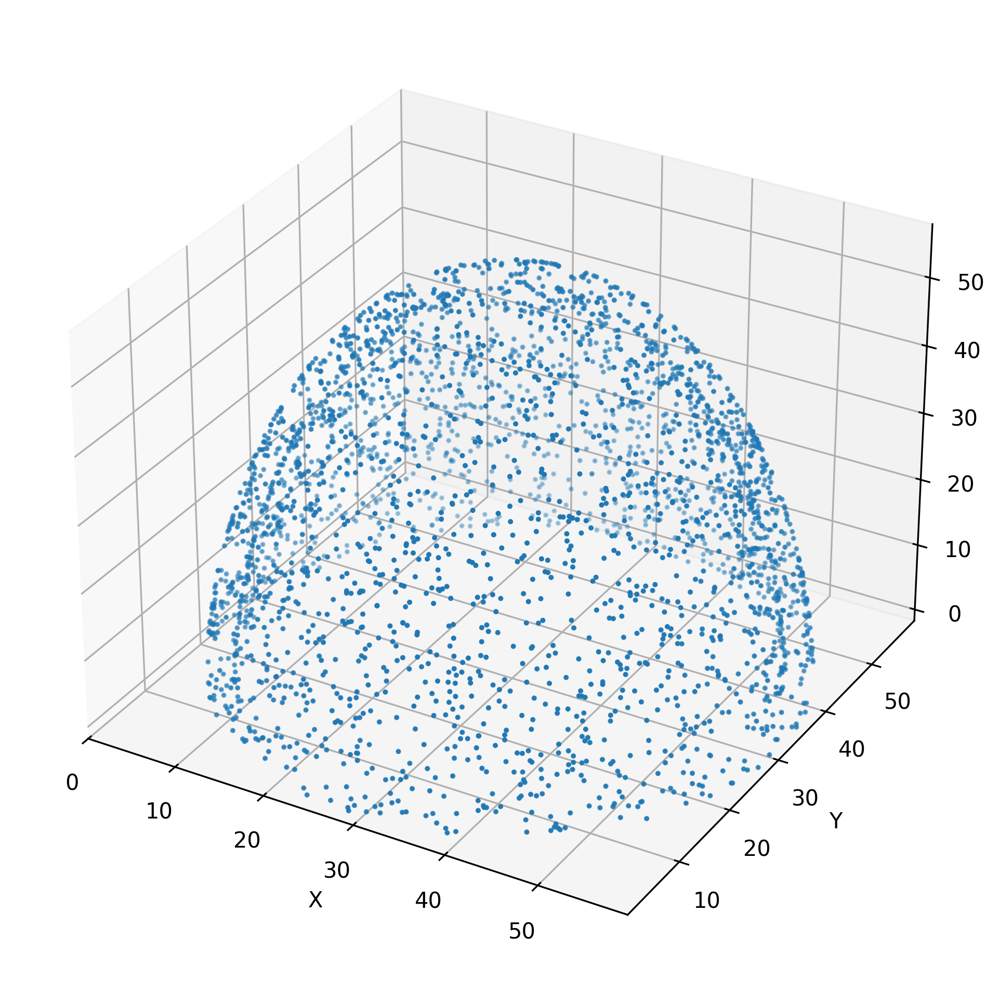
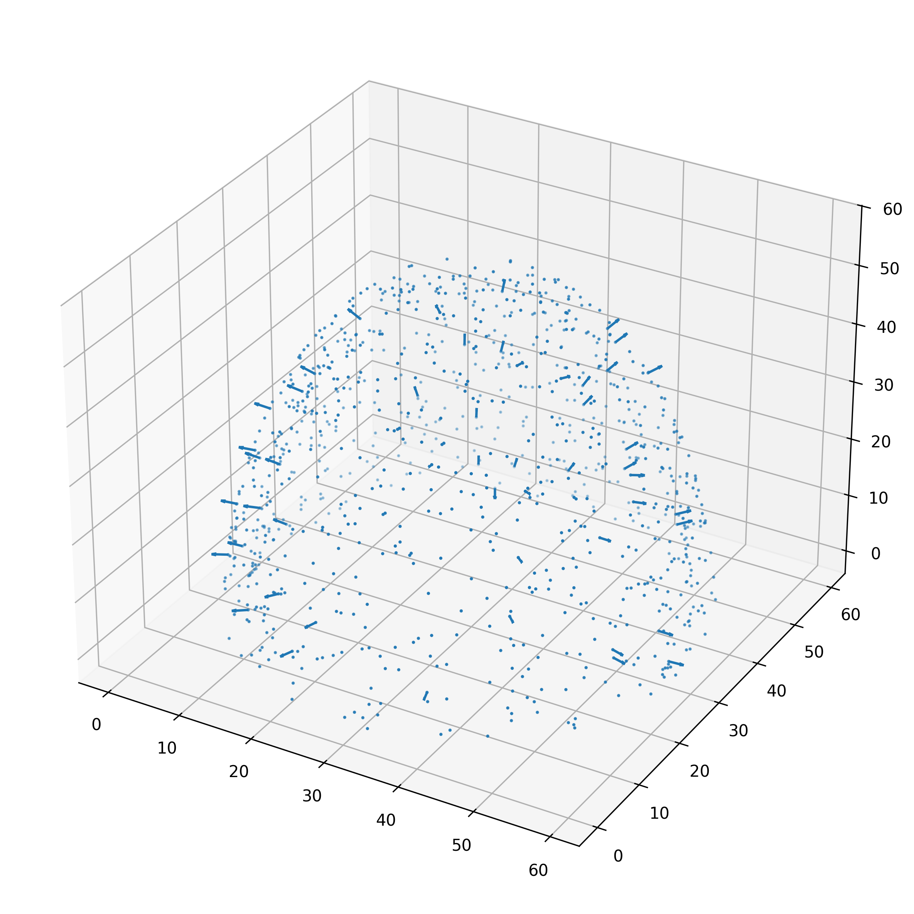
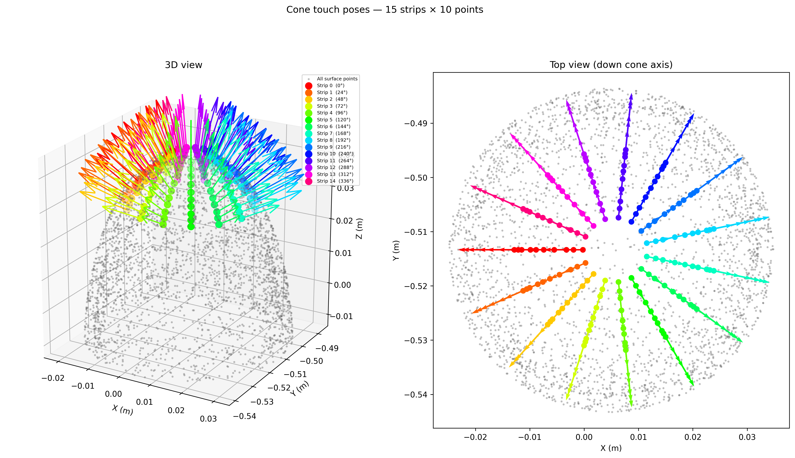

# Tactile UR5

Automated tactile exploration of silicone breast phantoms ("eggs") using a UR5 robot arm, aiming to **locate an embedded hard "tumor" ball from touch alone**. The pipeline extracts surface geometry from a CAD model, calibrates it to the robot's coordinate frame via ICP, generates approach/press poses over the surface, executes them on the physical (or simulated) robot over a raw URScript TCP socket, and records the contact force (ATI Nano17) synchronized with the TCP pose for each press.

```
cone.STL → surface points → ICP calibration → touch poses → robot execution → force+pose recording
```

Two sensing approaches share that pipeline and are kept deliberately separate:
the **ATI Nano17** on the end-effector pressing the phantom (above), and a
**XELA uSkin tactile pad** on the end-effector recording raw tactile counts
([see below](#xela-tactile-skin-separate-approach)). They have their own pose
grids, recorders and analysis; neither modifies the other.

---

## Hardware

| Component | Details |
|---|---|
| Robot | Universal Robots UR5 (CB2 controller, PolyScope 1.x) |
| Tool | Silicone breast phantom tactile sensor ("egg"), some with an embedded hard ball |
| Tool tip offset | 86 mm along TCP +Z axis |
| Force sensor | ATI Nano17 (SI-50-0.5), serial `FT12876` |
| Force DAQ | NI-DAQ, read via pyForceDAQ (`nidaqmx` backend) |
| Real robot IP | `192.168.0.110` (set as `REAL_HOST` in `pose_utils.py`) |
| Simulation IP | `172.17.0.2` (URSim Docker) |
| Touch-program port | `30002` (secondary client) — used by `run_side_strip_poses.py` so the streamed program does **not** suspend the state broadcast |
| Command / state port | `30003` (single moves like home/start/stop, and the 125 Hz TCP-pose stream the recorder reads) |

---

## Setup

The workstation dependencies are pinned in `requirements.txt`. The `cad_env/`
virtualenv is **not** tracked in git — recreate it from the requirements file:

```bash
# Create and activate the virtualenv, then install dependencies
python3 -m venv cad_env
source cad_env/bin/activate
pip install -r requirements.txt
```

On later sessions just activate it:

```bash
source cad_env/bin/activate
```

**DAQ PC only** — the force + pose recorder in `pyForceDAQ/` additionally needs
`nidaqmx` and `psutil` (uncomment them in `requirements.txt`), the NI-DAQmx
system driver, and `atidaq.so` built from `pyForceDAQ/atidaq_cdll/`. See the
[Force + pose data collection](#force--pose-data-collection-pyforcedaq) section.

### Starting URSim (simulation)

The simulation IP (`172.17.0.2`, `SIM_HOST` in `pose_utils.py`) is the Docker
container's own bridge-network IP, not a host port — so it only matches if
this is the **first** container started on the default bridge network. Start
it, then power it on and release the brakes (also doable through the
PolyScope GUI at `http://localhost:6080/vnc.html`, no VNC client needed):

```bash
docker run --rm -d -p 5900:5900 -p 6080:6080 --name ursim universalrobots/ursim_e-series:latest

# Power on + release brakes via the dashboard server (or click through the
# same steps in the noVNC viewer above):
python3 - <<'EOF'
import socket, time
s = socket.create_connection(("172.17.0.2", 29999), timeout=5)
s.recv(4096)
s.sendall(b"power on\n"); time.sleep(3); print(s.recv(4096))
s.sendall(b"brake release\n"); time.sleep(3); print(s.recv(4096))
EOF
```

If another container already holds `172.17.0.2` (check with
`docker inspect -f '{{json .NetworkSettings.Networks.bridge.IPAddress}}' <name>`
for each container in `docker ps`), start this one on different host ports
(e.g. `-p 5901:5900 -p 6081:6080`) — the internal control ports (30001-30004,
29999) aren't published to the host at all, only reachable via the
container's own bridge IP, so host-port conflicts don't affect the robot
scripts, only the VNC viewer.

---

## Project structure

Scripts are grouped by pipeline stage. Every script resolves data files through
`paths.py`, so they can be run from any working directory (e.g.
`python pose_generation/generate_side_strip_poses.py` from the repo root).

```
tactile_UR5/
├── paths.py              # central path config (single source of truth)
├── pose_utils.py         # shared geometry + motion parameters
├── geometry/             # extract_points.py  (STL → surface points)
├── ur_calibration/       # ICP calibration scripts + their artifacts
├── pose_generation/      # generate_side_strip_poses.py  (surface points → touch poses)
├── execution/            # run_*.py + robot move/stop scripts
├── cone_plots/           # STL point-cloud / normals visualisation
├── pyForceDAQ/            # force + pose recording (ATI Nano17) and press-data analysis
│   └── cone_data/         # sync_cone_data.sh landing spot (gitignored)
├── ur5_tactile_data/      # per-egg recordings + analysis batch scripts (see below)
├── Xela_sensor/           # second, independent sensor approach (see below) - XELA uSkin tactile skin
│   └── palpation/         # pad-based palpation recorder + pose generator
├── data/                  # cone.STL + generated pose CSVs + fixture/mount CAD files
└── figures/               # plot outputs from the CAD/pose pipeline (steps 1-6)
```

---

## Pipeline

### Step 1 — Extract surface points from STL

Samples 3000 points (with surface normals) from the cone CAD model.

```bash
python geometry/extract_points.py
```

**Input:** `data/cone.STL`  
**Output:** `data/surface_points.csv` — columns: `x, y, z, nx, ny, nz` (in mm, STL frame)

---

### Step 2 — (Optional) Visualise the point cloud

```bash
# Plot sampled surface points
python cone_plots/cone_plot.py

# Plot surface points with corrected outward normals
python cone_plots/cone_plot_normals.py
```

**Outputs:** `figures/surface__points_cone_plot.png`, `figures/surface__points_cone_normals_plot.png`

| Point cloud | Surface normals |
|---|---|
|  |  |

---

### Step 3 — Record physical calibration points

Interactive CLI. Move the robot so the sensor tip physically touches the cone and read the TCP pose from the teach pendant for each point.

```bash
python ur_calibration/record_icp_points.py
```

- **Point 1 must be the cone apex** (top).
- Record 10–15 more points spread around the upper sides.
- Enter each pose as `x y z rx ry rz` (mm or m — auto-detected; radians for rotation).
- Type `done` when finished.

**Output:** `ur_calibration/physical_points.csv` — columns: `x_tcp, y_tcp, z_tcp, rx, ry, rz, x, y, z`

---

### Step 4 — Run ICP calibration

Aligns the STL point cloud to the robot base frame using the physical touch points as ground truth.

```bash
python ur_calibration/calibrate_icp.py
```

**Constrained to a vertical axis.** The calibration **pins the cone axis to the robot base +Z** and fits only the position (translation-only ICP). The reason: the calibration touch points all sit near the apex (top ~half of the cone), which barely constrains the axis *orientation* — a free ICP latches onto noise and produces a spurious ~20° tilt, making an upright cone look leaning in the base frame. Since the cone physically stands upright on a level surface, fixing the axis vertical removes that artifact and actually fits the points slightly better (RMS ≈ 2.2 mm vs 2.5 mm for the free fit on the original dataset; a careful 13-point recalibration reaches ~1.5 mm RMS). Rotation about the vertical is irrelevant for a surface of revolution, so it is left at identity.

> This assumes the robot base is mounted vertical and the cone sits on a level surface. If your base is genuinely tilted, restore a free ICP instead.

**Inputs:** `data/surface_points.csv`, `ur_calibration/physical_points.csv`, `data/cone.STL`  
**Outputs:**
- `ur_calibration/icp_transformation_matrix.txt` — 4×4 STL-to-robot transform (rotation = identity, i.e. cone upright)
- `ur_calibration/surface_points_base.csv` — surface points (with normals) in robot base frame (meters)

Calibration quality (mean/RMS/max error in mm) is printed on completion. Target: mean error < 5 mm.

---

### Step 5 — Validate calibration

Re-checks alignment by projecting recorded physical contact points onto the calibrated mesh.

```bash
python ur_calibration/validate_calibration.py
```

**Inputs:** `ur_calibration/physical_points.csv`, `ur_calibration/icp_transformation_matrix.txt`, `ur_calibration/surface_points_base.csv`  
Re-run `ur_calibration/calibrate_icp.py` if mean error exceeds 5 mm.

---

### Step 6 — Generate touch poses

Generates `NUM_STRIPS` vertical strips evenly distributed around the cone, each with `NUM_POINTS` touch points from near the apex down to `MIN_HEIGHT_FRACTION` of the cone height. All work is done in the cone's own axis frame (the vertical axis established during calibration). This is the only pose generator in the pipeline — pressing every one of the ~3000 sampled surface points isn't realistic, so only the evenly-spaced strip grid is generated and executed.

Each contact point is **synthesized directly on the strip's meridian** rather than picking the nearest measured point. Because the cone is a surface of revolution, this gives:

- **Straight strips** — every point of a strip sits at exactly the strip's azimuth, so the strip traces a clean line down the cone (no zig-zag from discrete sampling).
- **Even spacing, apex included** — target heights are evenly spaced including both endpoints, so the first point of every strip lands exactly on the true apex (instead of being offset by half a band width); the local cone radius still comes from a linear fit of the points within each height band.
- **Clean normals** — the surface normal is taken from the nearest measured point, projected into the meridian plane and forced outward (handles the apex too).

To keep the printed sensor holder clear of the cone and the wrist clear of the lower arm, the tool orientation is tilted toward vertical with a height-scaled magnitude: `MIN_ORIENTATION_TILT_DEG` (7°) at the apex band up to `MAX_ORIENTATION_TILT_DEG` (14°) at the lowest band. **Only the orientation tilts** — the contact point and press direction stay on the true surface normal — so the press stays near-perpendicular (≈5–15° off-normal). The applied tilt is recorded per pose in the `tilt_deg` CSV column.

**Apex orientation matches its strip's azimuth.** At the true apex the outward normal points straight up the cone axis, so azimuth has no local meaning there. `normal_to_rotvec()` in `pose_utils.py` resolves this case with a `y_hint`: the generator passes the strip's meridian-perpendicular direction, so the apex point's frame stays consistent with every other point in its strip. Descending a strip, the tool orientation therefore changes smoothly in pitch only — azimuth is constant top to bottom.

```bash
python pose_generation/generate_side_strip_poses.py
```

**Output:** `data/cone_touch_poses.csv` (with `strip`, `strip_angle_deg`, `tilt_deg` columns), `figures/cone_touch_poses.png`

The plot has two panels: a **3D view** (robot base frame) and a **top-down view** along the cone axis (good for checking the strips are evenly distributed around the circle).



Key parameters, defined as tunable constants at the top of the script (see the comments there for current defaults):

| Parameter | Description |
|---|---|
| `NUM_STRIPS` | Strips evenly distributed around the cone |
| `NUM_POINTS` | Touch points per strip (top → bottom) |
| `MIN_HEIGHT_FRACTION` | Lower bound of the strips (fraction of cone height). Lower it for more lower-cone coverage, at the cost of clearance (arm config keeps the wrist joints off the table, esp. on the near side toward the robot base). |

Both `NUM_STRIPS` and `NUM_POINTS` are free to change; the generator and executor adapt automatically. Each row in the pose CSV contains a paired approach pose (`approach_distance` = 15 mm stand-off along the surface normal) and a press pose (`press_distance` = 15 mm into the surface).

---

### Step 7 — Move robot to start pose

Moves the robot through a safe pre-pose to the hover position directly above the cone apex (30 mm clearance).

```bash
python execution/home_start.py
```

Prompts for `sim` or `real` mode. Motion sequence:

```
movej → Pre-pose [-π/2, -π/2, -π/2, -π/2, π/2, -π/2]
   └─ movel → Start pose (apex TCP + 30 mm Z)
```

To move directly to the start pose only (skipping the pre-pose joint move):

```bash
python execution/start_pose.py
```

To move to *only* the pre-pose joint configuration (skipping the movel to the
cone's start pose entirely) — e.g. as a safe, cone-independent waypoint
before positioning the robot for other work (such as the XELA calibration
rig, see below):

```bash
python execution/go_pre_pose.py
```

---

### Step 8 — Execute touch sequence

Streams the full URScript program to the robot. For each pose: transit to approach → press → retract. Prompts for `sim` or `real`. The robot returns to the start pose after all touches complete.

```bash
python execution/run_side_strip_poses.py
```

Motion strategy (`execution/run_side_strip_poses.py`):

- **Inverse kinematics is solved in software** (`ur5_ik_near` in `pose_utils.py`, validated UR5 FK/IK) for every pose, seeded from the previous solution within a strip and reset to the start config between strips — this both validates reachability (unreachable poses are flagged and skipped) and keeps a chained seed ready for the next strip's entry `movej`. The controller's `get_inverse_kin` is *not* used: it does a single Newton solve from one fixed seed, which cannot converge for poses spread all the way around the cone, leaving the arm reorienting without reaching the points.
- **Only the first point of each strip transits in joint space** (`movej([j1..j6])`) — that's the big swing from the start pose all the way around to the strip's azimuth, which needs the offline IK solve above.
- **Every other transit within a strip uses `movel`** to the precomputed Cartesian approach pose, at the slow contact speed (`*_approach_*`, same as the press itself) — consecutive points are millimetres apart and share the same azimuth (see apex-orientation note above), so a straight-line Cartesian move keeps the tool orientation locked to that azimuth the whole way.
- **Press and retract use `movel`** — short, controlled linear motion along the surface normal, at the slow contact speed (`*_approach_*` in `pose_utils.py`).
- **Between strips the tool lifts straight up** (`SAFE_LIFT_M` = 60 mm, base +Z) *before* the joint-space swing back to the start pose, so the `movej` arc cannot graze the cone (which otherwise registers a false press).
- **Settle pauses are mode-dependent** (`SETTLE`): 0.1 s in sim, 1 s on real.
- Each transit logs a **1-based** `pose`/`strip`/`point` identifier via `textmsg` (e.g. `pose 13 strip 2 point 1`) — visible in the PolyScope Log tab to identify the failing pose after a protective stop. `pose` numbering matches the 1-based press numbering `record_cone_press.py` writes, so a specific press can be traced back to the exact strip/point that produced it (the underlying `strip` column in the pose CSV itself stays 0-based).

> **Note on speeds:** `V_sim`/`A_sim`/`V_real`/`A_real` (joint speed/accel, rad/s and rad/s²) apply only to the once-per-strip entry `movej`; every within-strip transit, press, and retract moves at the `*_approach_*` linear speed/accel (m/s, m/s²) instead. Sim's transit values are pushed near the UR5 joint limit since there's no hardware to protect.

> **Horizontal rotation happens only at strip entry.** Because the apex sits on the cone's axis, the arm's *position* barely changes between strips, so the azimuth change between one strip and the next is carried almost entirely by wrist_3 — visible as the tool spinning in place right before descending into the new strip. This entry swing happens in free space, before any contact with the phantom, so it never affects press data; once inside a strip the tool holds a constant heading and only pitches over as it descends.

> **Real-robot caveat:** the software IK uses the *ideal* UR5 DH parameters, which match URSim exactly. On hardware the calibrated DH differs by ~mm, so a joint-commanded approach (a hover point) may land a few mm off — harmless, and the `movel` press still hits the correct Cartesian target. Always dry-run in sim first.

---

### Step 9 — Return to home

```bash
python execution/go_home.py
```

Sends a single `movej` command to the home configuration `[0, -π/2, 0, -π/2, 0, 0]`.

---

## Force + pose data collection (pyForceDAQ)

Records ATI Nano17 force synchronized with the UR5 TCP pose while the robot presses the cone. Each press is auto-detected from the force signal, and its **peak force** is logged together with the TCP pose at that instant. The recorder runs on the PC the NI-DAQ is connected to, in parallel with any of the `run_*.py` motion scripts.

Force comes from the Nano17 (far more accurate than the robot's built-in TCP-force estimate); the TCP pose is read from the UR real-time stream on port `30003`. Both are sampled in one loop so they share a single timestamp.

### One-time setup (on the DAQ PC)

```bash
# 1. Build and install the ATI calibration C library
cd pyForceDAQ/atidaq_cdll && make atidaq.so
sudo cp atidaq.so /usr/lib/atidaq.so

# 2. Install the NI-DAQ Python backend (requires the NI-DAQmx driver)
pip install nidaqmx

# 3. Install plotly (renders the live trajectory/press view; see "Live plot" below).
# Without it, record_cone_press.py prints a warning and keeps recording fine,
# just without the live HTML view.
pip install plotly
```

The sensor calibration file `pyForceDAQ/calibration/FT12876.cal` (the Nano17) is tracked in git, so a fresh checkout already has it. If your transducer has a different serial, drop its ATI `.cal` into `pyForceDAQ/calibration/` and update `SENSOR_NAME` in `record_cone_press.py`.

### Record

Two terminals on the DAQ PC:

```bash
# Terminal 1 — recorder (keep hands off the sensor during bias)
cd pyForceDAQ
python3 record_cone_press.py
# No sim/real prompt - this reads a physical Nano17 over NI-DAQmx, so there is
# nothing to record against URSim; it always uses REAL_HOST.
# Prompts for:
#   * the expected number of presses (blank to skip) - so a short file is
#     reported outright rather than discovered later
#   * the egg name: e.g. "red_mid" -> cone_data/red_mid/, or "none" for
#     cone_data/ directly.

# Terminal 2 — motion that presses the cone
python3 execution/run_side_strip_poses.py
```

Each detected press prints live (`Press N: peak Fz = … at TCP=[…]`) and also updates a **live 3D view** of the TCP path over the cone surface: a small local HTTP server (started automatically, default port `8765`, first free port at/after that) serves a page showing the cone surface (dark gray), the TCP path so far (black), and a red diamond + label (`#N <peak Fz>N`) at each detected press. The page polls a JSON file every `LIVE_PLOT_REFRESH_S` (default `0.5` s) and updates the plot **in place** with Plotly's `Plotly.react()` — unlike a page reload, this does not reset your pan/zoom/rotation, and the update is skipped entirely while you're dragging to rotate (so rotating the view stays smooth) or when the underlying data hasn't changed. The axis range is computed once from the calibrated cone surface (plus a margin) rather than auto-fit to the growing trajectory, so the camera has a stable frame to rotate around instead of fighting a rescaling view every poll.

By default it does **not** open a browser on the recording machine (`LIVE_PLOT_AUTO_OPEN = False`) — every run instead prints every reachable LAN URL (probed toward the robot's subnet first, since that's the network the viewing machine is normally on, then the machine's default route) to open from another machine:

```
Live plot - open from any machine on the same network:
  http://<this machine's IP>:8765/live_view.html
```

This matters in practice: WebGL (which Plotly's 3D plots need) often has no real GPU acceleration on a DAQ PC, and Chrome will visibly stall there (`GPU stall due to ReadPixels` in its logs) regardless of how few points are plotted — view it from a machine with a real GPU instead. Set `LIVE_PLOT_AUTO_OPEN = True` if you're recording on a machine with working GPU acceleration and do want it to also open locally.

The cone surface comes from `ur_calibration/surface_points_base.csv`, which is gitignored (regenerated by `calibrate_icp.py`) — a checkout that never ran calibration locally (e.g. a DAQ PC that only records, while calibration was done on the workstation) won't have it. Without it, the live plot still works but without the cone for scale/reference, and a warning is printed; copy the file over manually (e.g. through the same sshfs mount `sync_cone_data.sh` uses) if you hit this.

The HTML is rendered by a background thread that only ever takes a quick snapshot of the trajectory/press buffers — a slow render just makes the file update less often, it can never add lag to the 125 Hz DAQ loop. If `plotly` isn't installed it disables itself automatically with a warning; CSV recording is unaffected either way. Press `Ctrl-C` to stop the recorder once the motion finishes — the file is updated once more with the final state. Outputs are written to `cone_data/<egg name>/` (or `cone_data/` directly if you typed `none`), timestamped per session:

| File | Contents |
|---|---|
| `<ts>_trajectory.csv` | Continuous `t, x,y,z,rx,ry,rz, speed, Fx,Fy,Fz, Fmag` (~125 Hz) |
| `<ts>_presses.csv` | One row per detected press: peak `Fz` / `\|F\|` and the TCP pose at the peak |

**Press detection** thresholds on **`Fmag` = |F|** (not signed `Fz`) — a touch near the cone's embedded bulge can load mostly `Fx`/`Fy` with `Fz` negative, missing a `Fz`-only threshold even though `|F|` is well above it. A press starts once `Fmag` rises above `PRESS_ON_N` (`0.3 N`) and is only considered over once `Fmag` has stayed below `PRESS_OFF_N` (`0.15 N`) for `PRESS_OFF_DEBOUNCE_S` (`0.5 s`) — long enough to ride out the momentary dip some cones show between the soft outer shell and an embedded hard "tumor" ball, which would otherwise look like two separate presses. Thresholds sit well above the sensor noise floor (~0.03 N) but low enough to catch shallow contacts — a press over a high point of a phantom can peak at only ~0.4 N if the calibrated surface sits a couple of mm off.

After a press ends, new presses are ignored for `PRESS_REFRACTORY_S` (`1.5 s`) to filter out the rebound as the tool retracts. This window must stay **below the shortest real press-to-press gap** (~2.6 s at the current approach speeds), since a longer window would swallow weak presses outright and clip the impact peak off presses that start inside it.

**Speed gate against transit false-positives:** lowering the force threshold to catch shallow real presses also makes the detector sensitive to brief transit contacts — grazing the cone during a between-strip swing, or the tacky silicone momentarily sticking to the retracting tip. Both happen entirely while the tool is moving; a real press always contains the ~1 s stationary hold at the pressed position. A candidate press is only recorded if at least one in-contact sample had TCP speed ≤ `PRESS_HOLD_SPEED_MS` (`0.01` m/s); otherwise it's dropped and logged as `[info] ignored moving contact`.

**Contacts that are NOT recorded are announced.** Four things can silently
drop a press, and a run that looks clean can still be short — recording
`blue_mid` produced **284 presses for 288 commanded poses** with nothing on
screen to say so. The two causes turned out to be different, and both are now
reported as they happen and totalled at the end:

```
[MISSED] contact peaked at 0.28 N, below PRESS_ON_N=0.3 - NOT recorded
[MISSED] contact of 1.41 N suppressed by the 1.5 s refractory window - NOT recorded
[MISSED] moving contact of 0.87 N ignored - tool never stationary - NOT recorded
Press 183: peak Fz = 1.39 N ...
         ^ WARNING: that press contained 3 force bumps - it may have merged two presses
```

The merge warning matters as much as the threshold ones: `PRESS_OFF_DEBOUNCE_S`
exists to ride out the bimodal shell-then-ball curve, but it also bridges
genuinely separate presses, which is how `blue_mid` lost two poses whose force
was 1.41 N and 1.49 N — well above any threshold.

If you enter an expected press count at startup, a short file is stated
outright:

```
*** 284 of 288 expected presses - 4 MISSING ***
    Press numbering is now offset from pose numbering after each gap.
    Align by position against the pose CSV before comparing runs.
```

That last point is the one to watch: after a gap, `presses.csv` row *k* is no
longer pose *k*, so anything comparing specimens by row index is silently
misaligned from there on.

Logged at `LOOP_HZ` = 125 Hz.

**DAQ sample rate:** the Nano17 runs in HW-timed single-point mode, so the host must service the device every sample; too high a rate overruns the DAQ buffer (NI error `-200714`). `SENSOR_RATE` (default `500` Hz) keeps comfortable headroom over the 125 Hz logging loop. Lower it (e.g. `250`) if the overrun recurs on a loaded machine.

### Visualize a single recording

```bash
python pyForceDAQ/plot_cone_data.py [stamp]
```

`stamp` is the timestamp prefix of a recording (matches `<stamp>_trajectory.csv` / `<stamp>_presses.csv` in `pyForceDAQ/cone_data/`); if omitted, the most recently modified recording is used. Saves five PNGs to `figures/` (and shows them):

| File | Contents |
|---|---|
| `<stamp>_force_vs_time.png` | `Fz`/`\|F\|` over time, with detected press peaks marked |
| `<stamp>_speed_vs_time.png` | TCP speed over time |
| `<stamp>_trajectory_3d.png` | 3D approach paths into each press, the top 24 by peak force highlighted in gold and the next 24 in cyan (free-space transit between strips is filtered out) |
| `<stamp>_peak_force_per_press.png` | Peak `Fz`/`\|F\|` bar chart, one bar per press |
| `<stamp>_press_force_on_cone.png` | Peak force at each press mapped onto the calibrated cone surface, top/next-24 marked with star/triangle markers |

The same module also exposes `save_trajectory_3d_html` / `save_press_force_on_cone_html`, which render the equivalent interactive WebGL plots (Plotly) to standalone `.html` files. For batch use across a whole data folder, see [Per-egg data](#per-egg-data-ur5_tactile_data) below.

### Sync recordings from the DAQ PC

`sync_cone_data.sh` copies recordings from the DAQ PC (mounted via sshfs at `~/remote-server`) into this repo's `pyForceDAQ/cone_data/`. Run it on the workstation:

```bash
~/github_local/tactile_UR5/pyForceDAQ/sync_cone_data.sh          # one-shot copy
~/github_local/tactile_UR5/pyForceDAQ/sync_cone_data.sh --watch  # auto-copy every 10s
```

Copy is the default (originals kept; safe to run while a session is recording). `--watch [SECS]` polls on an interval; `--move` deletes the source files after copying. It mirrors the DAQ PC's folder structure recursively, so a per-egg subfolder recorded via the name prompt lands as `pyForceDAQ/cone_data/<egg name>/`. The batch plot script operates on `ur5_tactile_data/`, so **move or copy each synced egg folder from `pyForceDAQ/cone_data/` into `ur5_tactile_data/`** once it's synced, before running it below.

---

## Per-egg data (`ur5_tactile_data/`)

Recordings, one subfolder per egg, live in `ur5_tactile_data/` in this repo (not `~/ur5_tactile_data` — that location is deprecated). `empty/` is the reference phantom: the same body with no ball inside, pressed over the identical pose grid.

```
ur5_tactile_data/
├── plot_cone_data_batch.py    # raw force/trajectory plots, per egg
├── empty/                     # reference phantom (no ball)
│   └── <ts>_trajectory.csv, <ts>_presses.csv
├── red_mid/
│   └── ...
└── ...
```

`plot_cone_data_batch.py` walks every subfolder here, so a new egg folder (recorded, then synced/copied in as above) is picked up automatically — nothing needs to be registered by hand. It writes its outputs back into the egg's own subfolder, named `<egg>_<plot>.png`/`.html`.

---

## XELA tactile skin (separate approach)

A second, independent sensing approach alongside the cone/Nano17 pipeline
above: a XELA Robotics uSkin tactile pad mounted on the **UR5 end-effector**
and pressed against the phantom, recording **raw tactile counts** — there is no
force calibration and none is needed, since both the stop criterion and the
comparison between specimens are relative. Kept fully separate by design —
every script here is new; nothing in `pyForceDAQ/` is modified.

```
Xela_sensor/
├── xela_server, xela_viz, xela_log, xela_conf   # XELA's own compiled binaries (v1.7.8b)
├── xServ.ini              # sensor config (working config below)
├── xServ_sim_backup.ini   # original simulation-mode config, kept as a backup
└── palpation/
    ├── xela_palpation.py     # the recorder: walks a pose grid, presses each to a tactile target
    ├── make_xela_poses.py    # pad-sized pose grid generator (+ footprint plot)
    ├── measure_pad_axes.py   # one-off: measure the pad's axes in the tool frame
    ├── rederive.py           # re-derive results at a different target, offline
    └── data/                 # recordings land here
```

### Hardware / software

| Component | Details |
|---|---|
| Sensor | XELA Robotics uSkin, model **XR1944** (16 taxels in a 4×4 grid at 5 mm pitch, 24×28 mm pad), microcontroller ID **3** |
| Interface | ESD CAN-USB/2, socketcan (`can0`), 1 Mbit/s |
| Server | XELA's own `xela_server` binary (v1.7.8b), broadcasts JSON over WebSocket (`ws://<ip>:5000`) |
| Data | Raw, **uncalibrated** 16-bit X/Y/Z counts per taxel — this sensor generation has no native force calibration in XELA's own software (only uSPa22/44/46 do) |
| Module limit | 10 N / 25 kPa normal, **scaling with contact area** — the manual is explicit that half-surface contact means half the force |

### Bringing the sensor up

```bash
sudo ip link set up can0 type can bitrate 1000000   # once per boot/replug (or via the udev rule below)
cd Xela_sensor
./xela_server -f xServ.ini --ip 0.0.0.0 -l xela_server.log
cansend can0 203#07.00                                # manual start trigger - this old-protocol sensor doesn't auto-stream
./xela_viz -f xServ.ini                               # optional live visualisation
```

Stop the stream with `cansend can0 203#07.01`. The current `xServ.ini`
(`bustype = socketcan`, `channel = can0`, `model = XR1944`, `version = 1`,
`id = 3`) reflects several non-obvious fixes: `version = 1` is required for
this old CAN-ID layout (the newer default, `version = 3`, silently maps zero
taxels), and `--ip 0.0.0.0` is needed because this build otherwise binds only
the machine's LAN IP, leaving `xela_viz`/localhost clients with no data. The
`[viz]` section is also tuned (`arrows = full`, `origins = on`,
`transparency = on`) — note the shipped defaults wrote comments *after* values
on the same line, which Python's `configparser` does not strip by default, so
those settings may never have taken effect.

### Pose grid

`make_xela_poses.py` generates poses sized for the **pad**, not for a point
tip. The cone grid (`cone_touch_poses.csv`, 288 poses) was built for the
Nano17's 0.7 mm indenter — consecutive poses sit 0.8 mm apart, which for a
24×28 mm pad means re-measuring the same contact patch over and over. This
generator instead places rings spaced by pad footprint down the slant, with
`circumference / spacing` poses in each ring, so coverage adapts to the taper.

```bash
python3 Xela_sensor/palpation/make_xela_poses.py
```

**Output:** `data/xela_poses_nano17reg.csv` (23 poses in 3 rings, ~53% pad
overlap at 12 mm spacing), plus `figures/xela_poses_nano17reg.png` showing the
actual pad footprints — the overlap and the overhang past the phantom edge are
invisible from centre markers alone.

Two things it does that the point-tip generator does not:

- **Wrist-3 minimisation.** `normal_to_rotvec` ties the tool yaw to the ring
  azimuth, so a ring sweeping 0→360° spins J6 a full turn; four rings
  accumulated **~1400° in one direction**, which both exceeds the ±360° joint
  limit and wraps the sensor cable four times. Rotation about the press axis
  carries no information here (the pad is read as a whole-pad scalar), so the
  generator searches that spin per pose and keeps whichever puts J6 nearest
  neutral: **1400° → 59°**.
- **A higher floor.** `MIN_HEIGHT_FRACTION = 0.65` versus the cone grid's 0.45.
  The binding constraint is not the contact height but the **pad edge**: the
  pad reaches ~14 mm past its centre, so at the 14° tilt used low down its
  lower edge sits ~10 mm below whatever it touches. At 0.50 the lowest ring hit
  the platform and every one of its poses "reached target" in 2–4 mm.

### Recording

```bash
python3 Xela_sensor/palpation/xela_palpation.py
```

Prompts for `sim`/`real` and a **specimen name**; writes `<name>.csv` (the full
trajectory) and `<name>_summary.csv` (one row per pose). An existing name is
never overwritten — repeats become `<name>_2`, `<name>_3`.

At each pose it settles, takes a per-pose baseline, approaches until the
taxels register contact, then presses until the **total** response across all
16 taxels reaches `TARGET_TOTAL_COUNTS`. Motion is continuous rather than
stepped: one slow `movel` that the sensor interrupts with `stopl()`, so
overshoot is latency × speed (~0.4 mm) instead of a step size.

**Why total and not peak.** Peak is a single-taxel reading, so any corner
touching hard ends the press regardless of how little of the pad is loaded. In
one run every pose reported "1400 peak counts" while the actual load spanned
**3187–11337** — a 96% spread, and those are not comparable measurements. On
the total criterion the same 23 poses land within **1.2%** of each other.

Useful flags:

| Flag | Effect |
|---|---|
| `--check` | Offline reachability + joint-limit + cable wind-up check. No robot, no sensor. |
| `--monitor` | Live per-taxel readout with running maxima. No robot motion. |
| `--motion-only` | Visit approach poses without pressing — for URSim, where there is nothing to touch. |
| `--limit N` | First N poses only. |
| `--target-total N` | Override the stop target. |

**Outcome per pose** (`reason` in the summary): `ok` (reached target),
`travel_cap` (18 mm, still climbing), `over_range` (a taxel hit 2200 counts —
recorded and the sweep continues), `no_contact`, `xela_stalled`. A pose whose
response stops growing is *flagged* (`went_flat`) but never stopped — stopping
on it made marginal poses bistable, reporting 485 counts on one run and 1418 on
the next for the same physical egg.

### Re-deriving at a different target

Every press is logged continuously, so a run recorded at one target still
contains everything needed to answer "where would it have stopped at a lower
one?".

```bash
python3 Xela_sensor/palpation/rederive.py --target 4000
```

This matters: 8000 was originally chosen from a firm specimen and turned out to
need 14–17 mm on soft ones, where the UR5's own protective stop engaged. The
whole set was re-derived at 5000 without touching the robot. **Keep the
trajectory CSVs** — the summaries alone cannot do this.

### What was tried and rejected

Recorded here so it is not repeated:

- **Converting counts to Newtons at all.** Per-taxel calibration is not
  achievable on this sensor — cross-talk spreads load to neighbours above
  ~1–1.5 N — and a whole-pad model caps at ~0.66 N RMS with a flat learning
  curve, so more data does not lift it. Palpation therefore works in **raw
  counts**, which is sufficient: the stop criterion and the comparison between
  specimens are both relative.
- **Re-aiming the pad to centre the contact** — the mechanism works (it centres
  by the predicted amount once the pad-axis mapping is measured rather than
  assumed), but outcomes got **worse**: mean peak 1218 → 991 over the same four
  poses. The correlation that motivated it was confounded — where the pad
  happens to sit flat it gets both a central contact and good loading, and
  tilting to force centring does not create flatness. Kept behind `--adapt`,
  off by default.


---

## Video demo

[](https://www.youtube.com/watch?v=YsXVEiOJwH0)

---


### TCP pose utilities (real robot)

Read the current TCP pose, or jog the robot to a given pose. Both use the same
format — 6 space-separated values, `x y z` in **mm** and rotation vector
`rx ry rz` in **rad** (base frame) — so a printed pose can be pasted straight
back as a move target.

```bash
# Print the current TCP pose as a single line, e.g.
#   2.490 -513.500 211.850 -2.200000 2.200000 0.000000
python execution/print_tcp_pose.py

# Move the TCP to a pose (prompts for it, or pass as arguments).
# Confirms before sending, then does a linear movel from the current pose
# at the slow approach speed.
python execution/move_to_pose.py [x y z rx ry rz]
```

> `move_to_pose.py` moves **linearly** from wherever the robot is — the path
> doesn't know about the cone, so don't command a pose on its far side.

---

### Emergency stop

Immediately decelerates and stops the robot (does not require mode selection).

```bash
python execution/stop_robot.py
```

Sends `stopl(2.5)` directly to the real robot (`REAL_HOST` in `pose_utils.py`, `192.168.0.110`).

---

### Shutdown

Returns to the home configuration, then powers down the real robot controller. Requires typing `yes` to confirm before sending.

```bash
python execution/shutdown_robot.py
```

---

### Live monitoring (CB2 controllers)

This robot is a **CB2** controller (PolyScope 1.x) — it has no Dashboard Server (introduced in CB3), so there's no scripted way to read robot state/logs through that interface. The pendant's Log tab is fed live from a Robot Message stream on the **Primary client interface (port 30001)**; the on-disk log file (`/root/log_history.txt` on the controller) is only flushed at boot/shutdown boundaries, so tailing it over SSH misses everything in between, including `textmsg()` calls from a running program.

`watch_robot_messages.py` connects directly to port 30001 and decodes that live stream, mirroring what the pendant shows in real time (mode changes, protective/E-stop events, and the per-pose `textmsg` calls from `run_side_strip_poses.py`):

```bash
python execution/watch_robot_messages.py
```

Prompts for `sim`/`real`. Streams to the terminal and also saves to `execution/robot_logs/<timestamp>_messages.log`. Ctrl-C to stop. Run it in a separate terminal alongside any motion script to track progress and catch a protective stop the instant it happens.

---

## File Reference

| File | Description |
|---|---|
| `requirements.txt` | Pinned workstation dependencies; recreate the venv with `pip install -r requirements.txt` |
| `paths.py` | Central path config — absolute locations of all data files; imported by every script |
| `pose_utils.py` | Geometry helpers (TCP↔contact conversion, normal→rotation vector, orientation tilt), **UR5 forward/inverse kinematics** (`ur5_fk`, `ur5_ik_near`) used for offline IK, and shared motion parameters (speeds, distances, tilt limits) |
| `data/cone.STL` | CAD model of the silicone cone tool |
| `data/egg_holder_4_revolvehole-3mm.SLDPRT` / `.STL` | SolidWorks part + STL export for the egg holder fixture (current revision; ~95×86×95mm bounding box) |
| `data/xela_sensor_mounted.SLDPRT` / `.STL` | SolidWorks part + STL export of the mount attaching the XELA sensor to the **UR5 end-effector** (~99.5×59×80.7mm bounding box) |
| `data/xela_sensor_breadboard_mount.SLDPRT` / `.STL` | Mount attaching the XELA sensor to the **optical breadboard/platform** (~70×59×70mm bounding box). Unused by the current pipeline, which mounts the pad on the end-effector — kept for bench tests against a fixed sensor |
| `data/tip_touch_li_0.7.SLDPRT` / `.STL` | Sharper indenter tip (~21×34×21mm bounding box) — a narrower alternative to the standard cone-press tip |
| `geometry/extract_points.py` | Sample surface points and normals from STL |
| `cone_plots/cone_plot.py` | Visualise sampled surface point cloud |
| `cone_plots/cone_plot_normals.py` | Visualise surface points with corrected outward normals |
| `ur_calibration/record_icp_points.py` | Interactively record physical touch points from the teach pendant |
| `ur_calibration/calibrate_icp.py` | Align STL to robot base frame — axis pinned vertical, translation-only fit (avoids the spurious tilt a free ICP gets from apex-clustered points) |
| `ur_calibration/validate_calibration.py` | Verify calibration quality against recorded points |
| `pose_generation/generate_side_strip_poses.py` | Generate poses for multiple strips around the cone, top to bottom |
| `execution/run_side_strip_poses.py` | Execute side strip touch sequence on the robot |
| `execution/home_start.py` | Move robot through pre-pose to start pose |
| `execution/start_pose.py` | Move robot directly to start pose |
| `execution/go_pre_pose.py` | Move robot to the pre-pose joint configuration only (cone-independent waypoint) |
| `execution/go_home.py` | Return robot to home configuration |
| `execution/print_tcp_pose.py` | Print the real robot's current TCP pose (one line: `x y z` mm + `rx ry rz` rad) |
| `execution/move_to_pose.py` | Move the real robot's TCP to an input pose (same format; confirms, then slow linear move) |
| `execution/stop_robot.py` | Emergency stop |
| `execution/shutdown_robot.py` | Return home, then power down the real robot controller (requires typing `yes` to confirm) |
| `execution/watch_robot_messages.py` | Live-decode the Robot Message stream (port 30001) — mirrors the pendant's Log tab in real time |
| `pyForceDAQ/record_cone_press.py` | Record Nano17 force + UR5 TCP pose; auto-detect each press (with a speed gate against transit false-positives) and log its peak force with the pose at that instant; prompts for an egg name to record into a per-egg subfolder |
| `pyForceDAQ/plot_cone_data.py` | Plot one recorded session: force/speed over time, 3D approach paths and peak-force-on-cone-surface (top presses by force highlighted); also exposes interactive Plotly HTML variants |
| `pyForceDAQ/sync_cone_data.sh` | Copy recordings from the remote DAQ PC (sshfs mount) into `pyForceDAQ/cone_data/` |
| `pyForceDAQ/calibration/` | ATI sensor calibration files (`FT12876` = Nano17, `FT12877`) |
| `ur5_tactile_data/plot_cone_data_batch.py` | Batch-run `plot_cone_data.py`'s plots over every egg folder here; skips recordings whose plots are already up to date |
| `Xela_sensor/xServ.ini` | XELA server config for this sensor (`socketcan`/`can0`, model `XR1944`, `version = 1`, `id = 3`) |
| `Xela_sensor/xServ_sim_backup.ini` | Original simulation-mode config, kept as a backup |
| `Xela_sensor/palpation/xela_palpation.py` | Walk a pose grid pressing each pose to a total tactile-count target; continuous sensor-interrupted motion, per-pose baseline, stall detection; `--check` / `--monitor` / `--motion-only` |
| `Xela_sensor/palpation/make_xela_poses.py` | Pad-sized pose grid (rings spaced by footprint) with wrist-3 minimisation; also writes the pad-footprint plot |
| `Xela_sensor/palpation/measure_pad_axes.py` | One-off: tilt a known amount on a flat surface to measure which tool axis each taxel-grid axis maps to |
| `Xela_sensor/palpation/rederive.py` | Re-derive per-pose results at a different count target from recorded traces — no robot needed |
| `Xela_sensor/palpation/data/` | Palpation recordings (`<specimen>.csv`, `<specimen>_summary.csv`) |
| `ur_calibration/record_icp_points_xela.py` | Record ICP points using the pad as the probe: descends until the taxels register contact, corrects for where on the pad the touch landed |
| `data/surface_points.csv` | Raw STL surface points (mm, STL frame) |
| `ur_calibration/surface_points_base.csv` | Surface points in robot base frame (m) |
| `ur_calibration/physical_points.csv` | Recorded physical touch points from teach pendant |
| `ur_calibration/icp_transformation_matrix.txt` | 4×4 STL-to-robot transform from ICP |
| `data/cone_touch_poses.csv` | Side strip touch poses (with strip index and tilt per pose) |
| `figures/` | Plot outputs from the CAD/pose pipeline (steps 1–6) |
| `pyForceDAQ/cone_data/` | `sync_cone_data.sh` landing spot for recordings synced from the DAQ PC (gitignored) |
| `ur5_tactile_data/<egg>/` | Per-egg recordings (`<ts>_trajectory.csv`, `<ts>_presses.csv`) and analysis outputs |
| `cad_env/` | Python virtual environment |

---

## Key Parameters

Defined in `pose_utils.py` and the generator/analysis scripts:

| Parameter | Value | Location |
|---|---|---|
| Tool tip offset | `[0, 0, 0.086]` m | `pose_utils.py` |
| Start clearance | `0.03` m (30 mm above apex) | `pose_utils.py` |
| Default start orientation | `[-2.2, 2.2, 0.0]` rad | `pose_utils.py` |
| Approach stand-off | `0.015` m | `pose_utils.py` |
| Press depth | `0.015` m | `pose_utils.py` |
| Orientation tilt (off-normal) | `7°` apex band → `14°` lowest band (`MIN/MAX_ORIENTATION_TILT_DEG`) | `pose_utils.py` |
| Sim transit speed / accel (joint) | `V_sim = 3` rad/s, `A_sim = 8` rad/s² | `pose_utils.py` |
| Real transit speed / accel (joint), ATI | `ATI_V_real = 0.7` rad/s, `ATI_A_real = 0.35` rad/s² — the unprefixed `V_real`/`A_real` default to these | `pose_utils.py` |
| Real transit speed / accel (joint), XELA | `XELA_V_real = 0.1` rad/s, `XELA_A_real = 0.2` rad/s² — larger, heavier tool with a cable | `pose_utils.py` |
| Sim approach (contact) speed / accel | `V_approach_sim = 1` m/s, `A_approach_sim = 2.5` m/s² | `pose_utils.py` |
| Real approach (contact) speed / accel | `V_approach_real = 0.1` m/s, `A_approach_real = 0.2` m/s² | `pose_utils.py` |
| Lift before return to start | `SAFE_LIFT_M = 0.06` m (base +Z) | `execution/run_side_strip_poses.py` |
| Settle pause (sim / real) | `0.1` s / `1` s | `execution/run_side_strip_poses.py` |
| Number of strips | `NUM_STRIPS = 24` — tunable, evenly around the cone | `pose_generation/generate_side_strip_poses.py` |
| Points per strip | `NUM_POINTS = 12` — tunable, apex → lower bound | `pose_generation/generate_side_strip_poses.py` |
| Side strip lower bound | `MIN_HEIGHT_FRACTION = 0.45` — tunable, fraction from base | `pose_generation/generate_side_strip_poses.py` |
| Press detect threshold | `PRESS_ON_N = 0.3` N on / `PRESS_OFF_N = 0.15` N off, on `Fmag` | `pyForceDAQ/record_cone_press.py` |
| Press-off debounce | `PRESS_OFF_DEBOUNCE_S = 0.5` s | `pyForceDAQ/record_cone_press.py` |
| Press refractory window | `PRESS_REFRACTORY_S = 1.5` s (keep below the shortest press-to-press gap) | `pyForceDAQ/record_cone_press.py` |
| Press hold-speed gate | `PRESS_HOLD_SPEED_MS = 0.01` m/s — a candidate press needs an in-contact sample at/below this speed to count | `pyForceDAQ/record_cone_press.py` |
| DAQ sample rate | `SENSOR_RATE = 500` Hz | `pyForceDAQ/record_cone_press.py` |
| Force log rate | `125` Hz (`LOOP_HZ`) | `pyForceDAQ/record_cone_press.py` |
| Force sensor | `FT12876` (Nano17) | `pyForceDAQ/record_cone_press.py` |
| Near-miss report threshold | `NEAR_MISS_N = 0.10` N — contact peaking between this and `PRESS_ON_N` is reported as `[MISSED]` rather than ignored | `pyForceDAQ/record_cone_press.py` |
| XELA press target | `TARGET_TOTAL_COUNTS = 5000` (total over all 16 taxels) | `Xela_sensor/palpation/xela_palpation.py` |
| XELA per-taxel abort | `MAX_PEAK_COUNTS = 2200` | `Xela_sensor/palpation/xela_palpation.py` |
| XELA travel caps | `20` mm approach, `18` mm press | `Xela_sensor/palpation/xela_palpation.py` |
| XELA press speeds | `8` mm/s approach, `2` mm/s press (continuous, sensor-interrupted) | `Xela_sensor/palpation/xela_palpation.py` |
| XELA baseline settle | `SETTLE_S = 3.0` s — the pad sits ~35% of the press amplitude *below* its pre-press level afterwards and is still ~15% low a minute later | `Xela_sensor/palpation/xela_palpation.py` |
| XELA pose spacing / height floor | `12` mm spacing (~53% pad overlap), `MIN_HEIGHT_FRACTION = 0.65` | `Xela_sensor/palpation/make_xela_poses.py` |
| Live plot on/off | `LIVE_PLOT = True` | `pyForceDAQ/record_cone_press.py` |
| Live plot auto-open browser locally | `LIVE_PLOT_AUTO_OPEN = False` | `pyForceDAQ/record_cone_press.py` |
| Live plot HTTP port | `LIVE_PLOT_PORT = 8765` (first free at/after this) | `pyForceDAQ/record_cone_press.py` |
| Live plot re-render / poll interval | `LIVE_PLOT_REFRESH_S = 0.5` s | `pyForceDAQ/record_cone_press.py` |
| Live plot trajectory decimation / window | `LIVE_PLOT_DECIMATE = 5`, `LIVE_PLOT_MAX_POINTS = 3000` | `pyForceDAQ/record_cone_press.py` |
| Live plot cone surface point cap | `LIVE_PLOT_SURFACE_MAX_POINTS = 800` | `pyForceDAQ/record_cone_press.py` |
